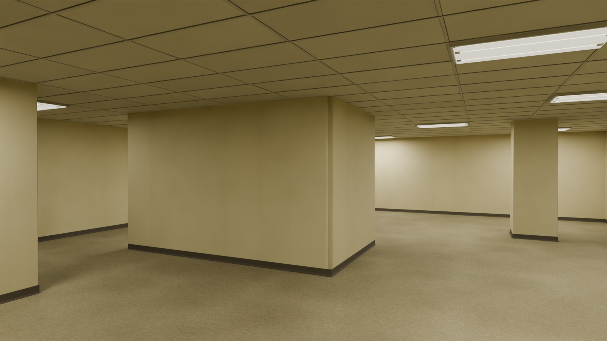

<div align="center">

# NULLSPACE

**You have a weapon. The building has ears.**

Single-player · First-person survival horror · In development

[](STATUS.md)
[](ARCHITECTURE.md)
[](#specifications)

**[Explore the website](https://github.marius4lui.dev/NULLSPACE/)** · [Game design](GAME_DESIGN.md) · [Development status](STATUS.md) · [Discussions](https://github.com/marius4lui/NULLSPACE/discussions)

</div>

[](https://github.marius4lui.dev/NULLSPACE/)

*Early Blender environment render using original project assets. Work in progress.*

Wake up on damp carpet beneath fluorescent lights. Somewhere inside an impossible commercial building, an exit is waiting for power. Choose a difficulty, restore its required Room 1 circuits, and remember your way back.

Something else is learning the building with you.

## The intended experience

- **One persistent threat.** The Listener is an original creature that follows sight and sound clues, searches, and can lose your trail.
- **Every shot has a cost.** A compact semi-automatic pistol buys time, but its noise gives away your position. Doors, cover and route choices matter.
- **A compact connected building.** Roughly 8–12 meaningful rooms: quiet arrival, nested offices, short service/blackout and the return to the exit.
- **Architecture you almost remember.** Offset openings, sparse landmarks and tactical doors help you navigate and escape.
- **A complete escape.** Easy uses one switch, Medium the two-switch baseline, and Hard/Nightmare add a third local circuit with a short latch or marked-fuse step. Every mode returns to the same exit and remains possible without ammunition.

These describe the intended game; implementation is still in early production.

## Built with GPT-6 Astra

NULLSPACE is an AI-developed game created with **GPT-6 Astra through Codex**, under the direction of [marius4lui](https://github.com/marius4lui). One agent now handles implementation, original asset creation and practical in-engine checks, reusing the existing work. This repository follows the development of the game, from its first rooms to a playable release.

## Specifications

| | Target |
| :--- | :--- |
| Engine | Godot 4.7.2 · Forward+ |
| Asset pipeline | Blender 5.2.1 LTS · original models, materials and animation |
| Platforms | Linux laptop first; Windows x86-64 cross-export when available |
| Game | 10–15 minutes · approximately 8–12 connected rooms · two switches |
| Equipment | One semi-automatic pistol · battery-free flashlight |
| Threat | The Listener · approximately 2.3 m tall |
| Performance | Laptop profile measured on Radeon 660M; see [actual measurements](PERFORMANCE.md), no other-hardware guarantee |

Minimum requirements are not established yet. Performance will be reported with the actual laptop, resolution and profile. A Windows cross-export is not native Windows validation.

## Current state

**[Download v0.3 — Beta Unstable](https://github.com/marius4lui/NULLSPACE/releases/tag/v0.3)** · Listener death feature · Android ARM64 preview, Linux x86-64 and Windows x86-64 · Unstable prerelease.

Android adds touch movement/look/fire/actions, mobile graphics profiles and pause/resume handling. The signed debug preview is built from the local offline template. Physical installation, real-device controls/audio/performance and full runs remain unverified; see [Android build and limitations](tools/android/README.md). Existing main difficulty modes and website changes are preserved. This is not the final Android release.

The public `main` branch contains the integrated two-switch game. The `feat/difficulty-room1` branch adds four fixed pre-start modes without adding levels, enemies, weapons or an inventory framework. **This is not a finished or fully optimized release.** Easy has a complete native exported-game run; the other modes complete in actual-scene automation but still need full native endings and listening review. Windows is cross-exported, not natively tested.

## Run and build from source

With Godot **4.7.2 stable** and its matching export templates installed:

```sh
git clone https://github.com/marius4lui/NULLSPACE.git
cd NULLSPACE
godot --editor --path game --import --quit
godot --path game
bash tools/build.sh linux
./build/linux/nullspace.x86_64
```

For an official portable Godot binary, set `NULLSPACE_GODOT_BIN` to that executable when invoking `tools/build.sh`. Use `windows` or `all` instead of `linux` for cross-exports. Production assets are checked in; Blender is not required to reproduce a game export. Source asset generators live under `tools/art/` and use the retained originals under `art/source/`.

Controls: WASD, mouse, Shift sprint, Ctrl crouch, F flashlight, E interact, left mouse fire, R reload, Escape pause. Settings cover audio, mouse/invert/FOV, display, VSync/FPS cap and reduced motion/flashes. See [playtest instructions](docs/PLAYTEST.md), [credits](CREDITS.md) and [licences/notices](LICENSES.md). Linux is the tested platform; Windows export is not native validation.

## Explore and contribute

| Looking for… | Start here |
| :--- | :--- |
| The world, creature and combat | [Game design](GAME_DESIGN.md) · [Art direction](ART_DIRECTION.md) |
| Technical decisions | [Architecture](ARCHITECTURE.md) · [Decision log](DECISIONS.md) |
| Current work and limitations | [Status](STATUS.md) · [Issues register](ISSUES.md) · [Next production steps](docs/NEXT_PRODUCTION_ACCEPTANCE.md) |
| Website source and local preview | [`site/`](site/) · [Website guide](docs/WEBSITE.md) |
| A bug report or suggestion | [Open an issue](https://github.com/marius4lui/NULLSPACE/issues/new/choose) · [Join a discussion](https://github.com/marius4lui/NULLSPACE/discussions) |
| A contribution or security report | [Contributing](CONTRIBUTING.md) · [Security](SECURITY.md) |

Original production assets are being created for NULLSPACE, with editable sources and generation/export records. No downloaded game-content packs are used. The raw beta is available; no final release date has been announced.

<div align="center">

**[Enter NULLSPACE →](https://github.marius4lui.dev/NULLSPACE/)**

</div>
